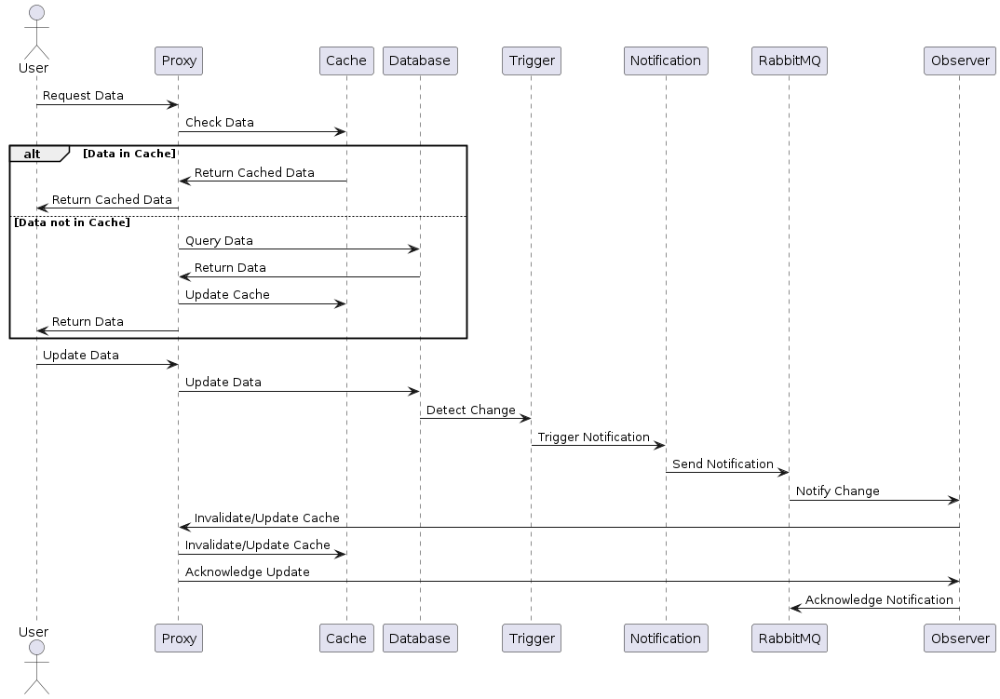
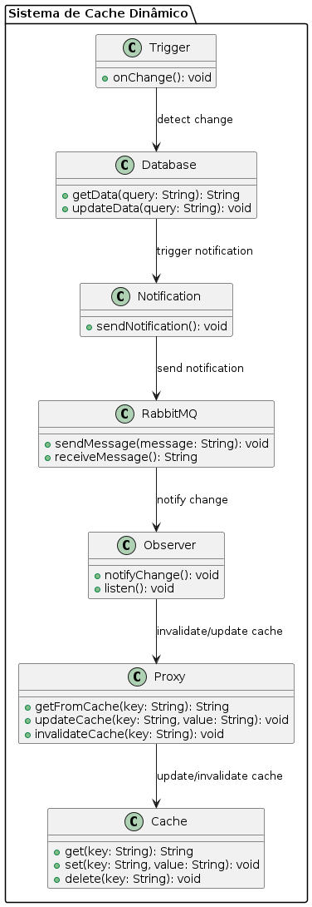

# Sistema de Cache Dinâmico para Site de Alta Demanda

## Descrição
Este projeto é um sistema de cache dinâmico projetado para otimizar o acesso a informações em um site de alta demanda, como e-commerce ou redes sociais. O sistema utiliza um padrão de design Proxy para gerenciar o acesso ao cache e um padrão Observer para monitorar atualizações nos dados, garantindo que o cache seja invalidado ou atualizado em tempo real.

## Arquitetura
O sistema é composto pelos seguintes componentes principais:

- **Proxy**: Intermediário que gerencia todas as requisições de dados. Verifica se os dados estão disponíveis no cache e, caso contrário, consulta o banco de dados. Também é responsável por invalidar ou atualizar o cache quando necessário.
- **Cache**: Armazena dados frequentemente acessados para garantir um acesso rápido e reduzir a carga no banco de dados.
- **Database**: Armazena as informações persistentes do sistema.
- **Trigger**: Aciona eventos quando ocorre uma alteração no banco de dados.
- **Notification**: Envia notificações sobre alterações detectadas no banco de dados.
- **RabbitMQ**: Gerencia a fila de mensagens para notificação de alterações.
- **Observer**: Monitora as notificações de alterações e instrui o Proxy a atualizar ou invalidar o cache.

## Funcionamento
1. **Requisição de Dados**: O usuário faz uma requisição de dados que passa pelo Proxy.
2. **Verificação do Cache**: O Proxy verifica se os dados estão no Cache.
   - Se os dados estiverem disponíveis, eles são retornados ao usuário.
   - Se não estiverem, o Proxy consulta o banco de dados.
3. **Consulta ao Banco de Dados**: O banco de dados retorna os dados ao Proxy, que atualiza o Cache e, em seguida, retorna os dados ao usuário.
4. **Atualização de Dados**: Quando o usuário atualiza dados, o Proxy envia a atualização para o banco de dados.
5. **Notificação de Alteração**: O Trigger detecta a alteração e envia uma notificação via RabbitMQ.
6. **Atualização do Cache**: O Observer recebe a notificação e informa o Proxy para invalidar ou atualizar o Cache.

## Tecnologias Utilizadas
- **Banco de Dados**: SQLServer, MongoDB, Redis
- **Mensageria**: RabbitMQ
- **Cache**: Redis
- **Frameworks**: .NET, FastApi

## Diagrama de Sequência

## Diagrama de Classe
